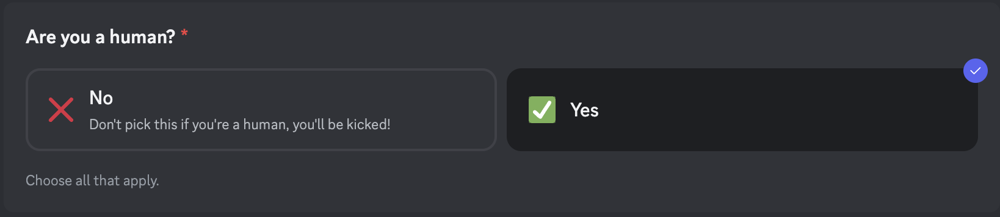
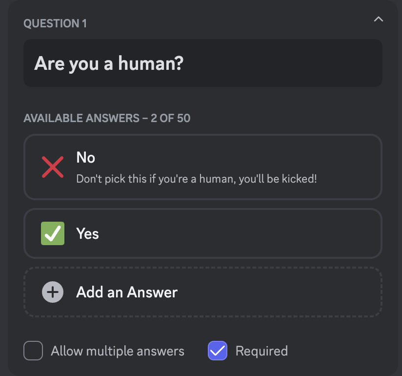
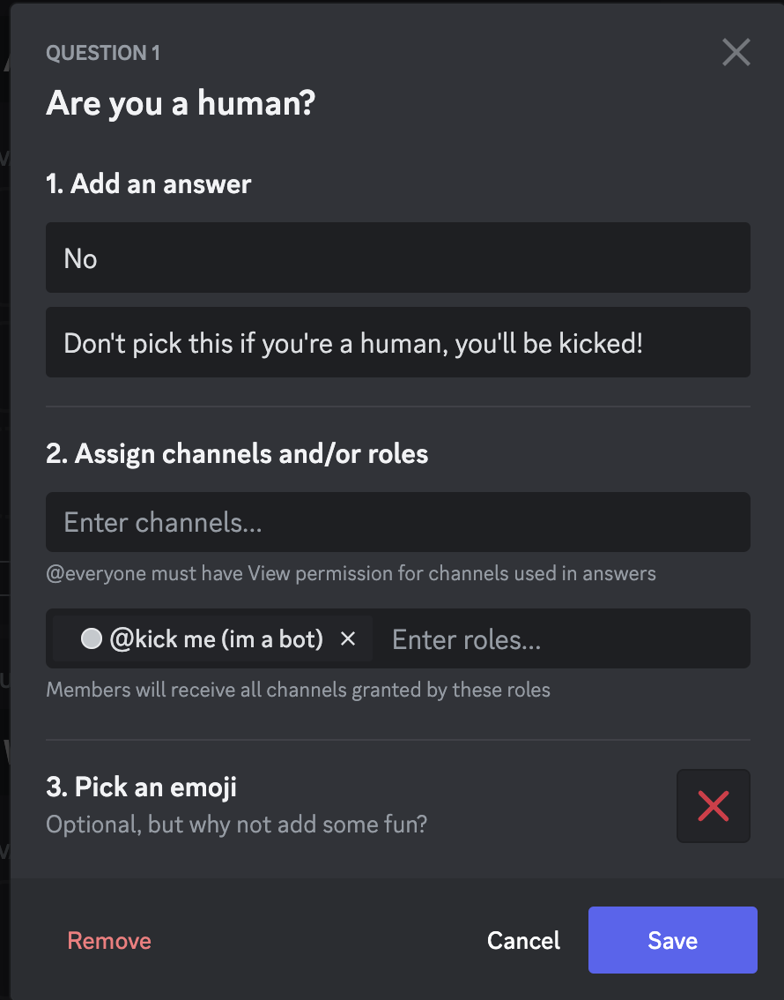

# No, you can't have that role!

A simple discord bot to automatically kick people who get a certain role.

This can be used fairly simply. The role's name simply must contain `kick me`, and any time a user
gains that role they will be kicked.

This can provide an effective way to combat some types of selfbots, which simply
choose the first option in onboarding, so you can have choosing the first option
assign a role with `kick me` in the name and boom, kick them.

## Example setup

